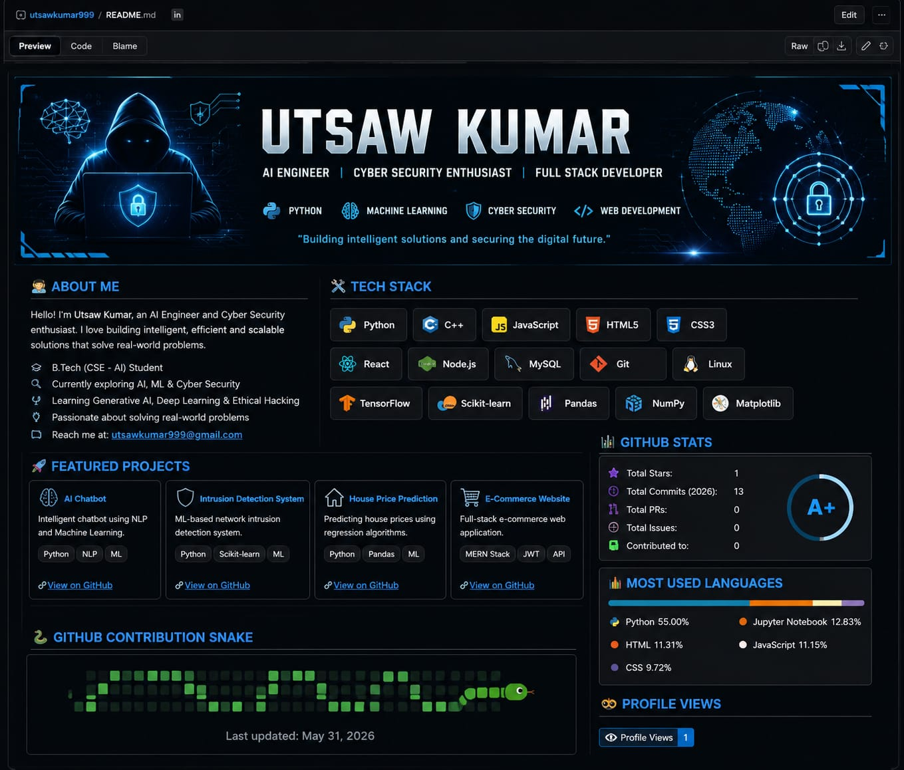

  

<h1 align="center">Hi 👋, I'm Utsaw Kumar</h1>

<h3 align="center">
IT Intern at Bharti Airtel | 3rd-Year B.Tech CSE (AI) Student |
Aspiring Cyber Security & AI Engineer
</h3>

---

## 👨‍💻 About Me

- 🎓 3rd-Year B.Tech CSE (Artificial Intelligence) Student
- 💼 Currently working as an **IT Intern at Bharti Airtel**
- 💻 Passionate about **Python, AI, Cyber Security & Software Development**
- 🌱 Currently learning **Machine Learning, Computer Networking & Cloud Computing**
- 🚀 Building real-world projects using Python
- 🎯 Goal: Become a Software Engineer & Cyber Security Professional

---

## 🛠️ Tech Stack

- **Programming:** Python, C, C++, SQL
- **Web:** HTML, CSS, JavaScript
- **Database:** MySQL
- **Tools:** Git, GitHub, VS Code
- **Operating Systems:** Windows, Linux
- **Domains:** AI, Cyber Security, Computer Networks

---

## 🚀 Featured Projects

## 📌 [Telegram Image & Location Tracker Bot](https://github.com/utsawkumar999/telegram-company-bot)

- Python-based Telegram Bot
- Image Upload & Location Tracking
- SQLite Database
- Admin Dashboard

## 🏠 [House Price Prediction](https://github.com/utsawkumar999/House-price-prediction)

- Machine Learning Project
- Linear Regression
- Python & Scikit-learn

---

## 📫 Connect With Me

- 💼 LinkedIn: https://linkedin.com/in/utsawkumar999
- 💻 GitHub: https://github.com/utsawkumar999

---

⭐ **Always learning, always building, and always improving.**

## 📊 GitHub Stats

## 👀 Profile Views

